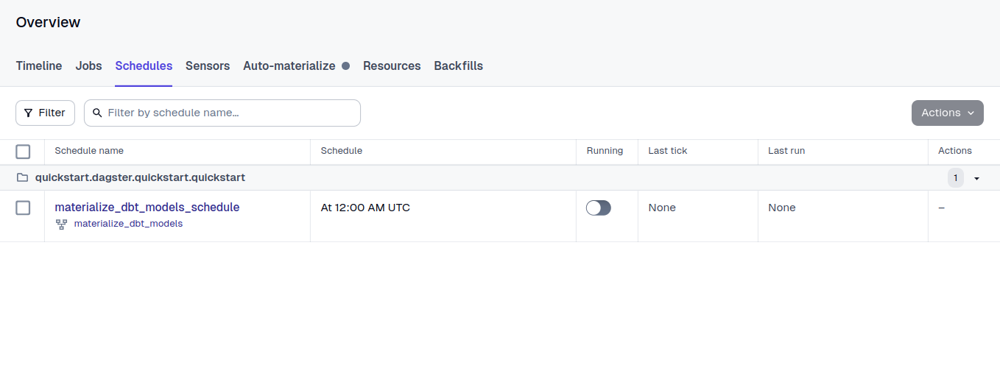

import { Image } from 'astro:assets';

# Scheduling
- In `dagster/<example-project>/<example-project>/__init__.py` add the following code:
    
    ```python title="dagster/<example-project>/<example-project>/__init__.py" {3-10,15} showLineNumbers
    from dagster_dbt import build_schedule_from_dbt_selection
    
    schedules = [
        build_schedule_from_dbt_selection(
            [dbt_project_assets],
            job_name="materialize_dbt_models",
            cron_schedule="0 0 * * *",
            dbt_select="fqn:*",
        ),
    ]
    
    defs = Definitions(
        assets=[dbt_project_assets],
        jobs=[run_csv_to_iceberg_meltano_job],
        schedules=schedules,
        resources={
            "dbt": DbtCliResource(project_dir=os.fspath(dbt_project_dir)),
        },
    )
    
    ```
    
    The cron schedule **`0 0 * * *`** translates to:
    
    - **0**: At the 0th minute (i.e., the start) of the hour.
    - **0**: At the 0th hour (i.e., midnight).
    - *****: On every day of the month.
    - *****: In every month.
    - *****: On every day of the week.
    
    So, this schedule will trigger the **`materialize_dbt_models`** job at midnight (00:00) every day.
    
- To enable the schedule, reload definitions on dagster UI, go to `http://localhost:3000/locations/<example-project>/schedules` and turn on the toggle button under `Running`



<br />