import H1 from '@/components/H1.astro';
import { Image } from 'astro:assets';

# Quickstart

## Setup A Sidetrek Project

### Download and Install

1. Download and untar the file `sidetrek.x.x.xx-linux-x64.tar.gz`
2. Run this command to change permission:

  ```bash
  chmod +x install.sh && ./install.sh
  ```

3. After installing Sidetrek, check the version running `sidetrek --version` and it should print the version number.

### Create A Project

Run the command:

```bash
sidetrek init
```

- It will ask `Sidetrek requires Python 3.10-3.11, Poetry, and git CLI installed. Are you ready to continue?` Select `Yes`
- Then it will ask you to select the Python version- 3.10 and 3.11
- It will then ask you to enter the project name. Let’s name it `quickstart`
- Finally, it will ask you to select the data stack. Currently, we only have one data stack available.

After pressing Enter, Sidetrek will start scaffolding your project and setting up Dagster, Meltano, DBT, Trino and Superset.

If project is successfully initialized, you’ll see `You're all set - enjoy building your new data project! 🚀`

### Start the Project

Change working directory to your project directory by running `cd quickstart`

Once you are in the project folder, run the following command:

```bash
sidetrek start
```

Please note that you need to have docker, docker compose and docker desktop installed in your system. Also, remember that it will take a while to pull images when you run it for the first time.

Network related issues:


>> 💡 If you already have npm installed in your machine, you may get this error: `npm ERR! network In most cases you are behind a proxy or have bad network settings` To fix this, run `npm config rm proxy && npm config rm https-proxy`


Port related issues:


>> 💡 If you get an error that contains: `bind: address already in use` run `sudo lsof -i :<port-number>` and it will show the `PID` (Process ID). Then you can run `sudo kill <PID>`


Every time you want to restart the containers, run `sidetrek down` and then `sidetrek start`

Once, project is started successfully, you can see Dagster GUI at http://0.0.0.0:3000/

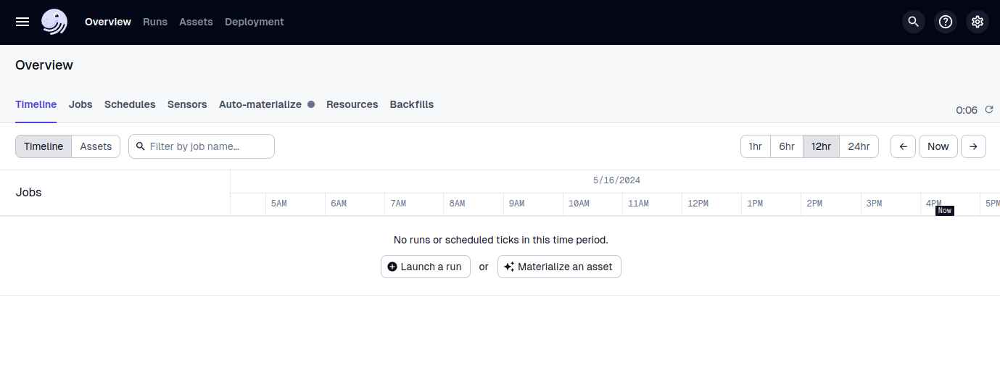

## About the Dataset

We’ll work with a dataset consisting of 4 csv files:
- Orders (orders.csv)
  - order_id: string
  - ordered_at: timestamp
  - product_id: string
  - product_qty: integer
  - customer_id: string
  - store_id: string

- Customers (customers.csv)
  - customer_id: string
  - customer_name: string
  - first_name: string
  - last_name
  - gender: string
  - country: string
  - address: string
  - phone_no: string
  - email: string
  - payment_method: string
  - traffic_source: string
  - customer_age: integer
  - device_type: string

- Products (products.csv)
  - product_id: string
  - product_name: string
  - product_category: string
  - unit_price: float
  - product_description: string

- Stores (stores.csv)
  - store_id: string
  - store_name: string
  - store_city: string
  - store_state: string
  - tax_rate: float
<br />
## Data Ingestion

- Inside `<example-project>/meltano/extract/`  add a file `file_def.json`:
    
  ```json title="example-project>/meltano/extract/file_def.json"
  [
    {
      "entity": "orders",
      "path": "../data/orders.csv",
      "keys": ["order_id"]
    },
    {
      "entity": "customers",
      "path": "../data/orders.csv",
      "keys": ["id"]
    },
    {
      "entity": "products",
      "path": "../data/products.csv",
      "keys": ["id"]
    },
    {
      "entity": "stores",
      "path": "../data/stores.csv",
      "keys": ["id"]
    }
  ]
  ```
  Entity is the table name, path is the file path and keys can be a list of any columns

Change directory to `<example-project>/meltano`
### Add the Extractor

Add the tap-csv extractor to your project using `[meltano add](https://docs.meltano.com/reference/command-line-interface#add)` :

```bash
meltano add extractor tap-csv
```

Configure the tap-csv [settings](https://hub.meltano.com/extractors/tap-csv/#settings) using `[meltano config](https://docs.meltano.com/reference/command-line-interface#config)`:

```bash
meltano config tap-csv set --interactive
```

You’ll see all the configuration settings and where it says `Loop through all settings (all), select a setting by number (1 - 9), or exit (e)? [all]:` enter `2` to select `csv_files_definition` . Where it says `New Value:` enter the filepath to the `file_def.json` file, i.e. `extract/file_def.json`. Press any key to return to the configuration list. Press`e` to exit `meltano config`

You can test the extractor by running `meltano config tap-csv test` and if plugin configuration is successful, you’ll see the message: `Plugin configuration is valid`

### Add the Loader

We’ll add a custom loader for Iceberg.

Run:

```bash
meltano add --custom loader target-iceberg
```

Hit Enter to choose the default value for `namespace` 

Insert `git+https://github.com/SidetrekAI/target-iceberg@bugfix/fields` for `pip_url`

Hit Enter to skip adding settings

Configure the target-iceberg using `meltano config`:

```bash
meltano config target-iceberg set --interactive
```

Enter the following values in the settings:

- add_record_metadata: true
- aws_access_key_id: $AWS_ACCESS_KEY_ID
- aws_secret_access_key: $AWS_SECRET_ACCESS_KEY
- s3_endpoint: [http://localhost:9000](http://localhost:9000/)
- s3_bucket: $LAKEHOUSE_NAME
- iceberg_rest_uri: [http://localhost:8181](http://localhost:8181/)
- iceberg_catalog_name: $ICEBERG_CATALOG_NAME
- iceberg_catalog_namespace_name: raw

    
Inside `<example-project>/dagster/<example-project>/` add the following to `__init__.py`:
    
  ```python title="<example-project>/dagster/<example-project>/__init__.py" {5} showLineNumbers
  from .meltano import run_csv_to_iceberg_meltano_job
  
  defs = Definitions(
      assets=[dbt_project_assets],
      jobs=[run_csv_to_iceberg_meltano_job],
      resources={
          "dbt": DbtCliResource(project_dir=os.fspath(dbt_project_dir)),
      },
  )
  ```
    
Go to http://0.0.0.0:3000/ and after reloading you’ll see run_csv_to_iceberg_meltano_job added to the list of jobs. 

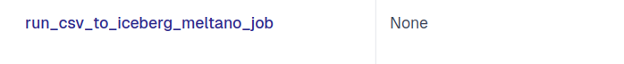

Click on the job, go to the tab Launchpad and click on Launch Run. The job will be run. 

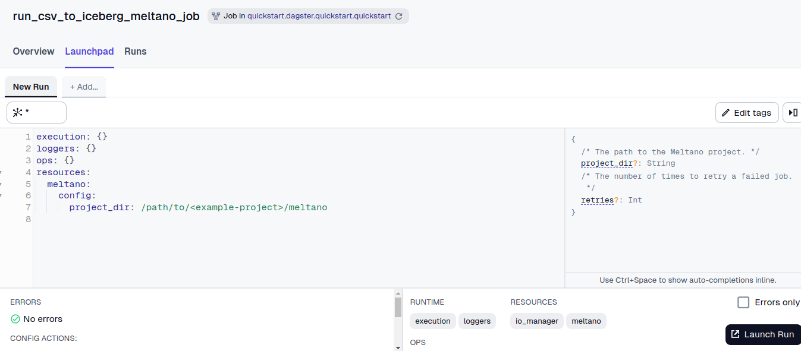

If the job is successfully run, you’ll see a new folder raw in your lakehouse, where you’ll see the 4 different tables written in iceberg table format.

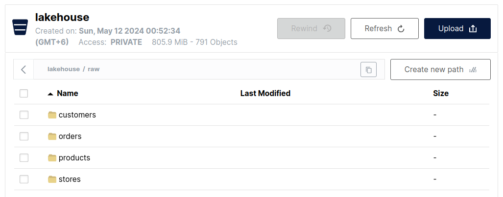

>> 💡 Every time you make any change, reload the job on Dagster UI 

## Transformation

### Adding dbt project

We’re going to follow the medallion architecture:

- **Staging:** In this stage, we’ll do some basic transformation and cleaning on the tables in `raw` schema. We’ll take care of null values and data types.
- **Intermediate:** In this stage, we’ll de-normalize all the tables
- **Marts:** In this stage, we’ll have our analytics-ready, clean, de-normalized tables which different teams can use.

### Staging Models:

- Inside `dbt/<example-project>/models` add a new directory `staging`
- Inside `staging`, add a properties file called `stg_iceberg.yml` (notice that `stg` represents the stage, and `iceberg` represents the database name) In `stg_iceberg.yml` file, add the following code:
    
    ```yaml title="dbt/<example-project>/models/staging/stg_iceberg.yml"
    version: 2
    
    sources:
      - name: stg_iceberg
        database: iceberg
        schema: raw
        tables:
          - name: orders
          - name: customers
          - name: products
          - name: stores
    
    models:
      - name: stg_iceberg__orders
      - name: stg_iceberg__customers
      - name: stg_iceberg__products
      - name: stg_iceberg__stores
    ```
    
- Here’s a little breakdown:
    - Version: Specifies the version of the model files in the same folder.
    - Sources: Defines the name of the source, sets the database name, sets the schema name, and lists all the tables in the schema.
    - Models: Lists all the models we are going to create.
- Inside `dbt/<example-project>/models/staging/` create the first sql model for staging stage called `stg_iceberg__orders.sql` and put the code in it:
    
    ```sql title="dbt/<example-project>/models/staging/stg_iceberg__orders.sql"
    {{
      config(
        file_format='iceberg',
        on_schema_change='sync_all_columns',
        materialized='incremental',
        incremental_strategy='merge',
        unique_key='order_id',
        properties={
          "format": "'PARQUET'",
          "sorted_by": "ARRAY['order_id']",
        }
      )
    }}
    
    with source as (
      select
        CAST(order_id AS VARCHAR) AS order_id,
        CAST(created_at AS TIMESTAMP) AS order_created_at,
        CAST(qty AS DECIMAL) AS qty,
        CAST(product_id AS VARCHAR) AS product_id,
        CAST(customer_id AS VARCHAR) AS customer_id,
        CAST(store_id AS VARCHAR) AS store_id
      from {{ source('stg_iceberg', 'orders') }}
    )
    
    select * from source
    ```
    
- Breakdown of the code:
    - `{{ config() }}` sets the file format as iceberg. If schema is changed, it is set to sync all columns in the table. There are these materializations that we can use in dbt: table, view, incremental, ephemeral, materialized, and view. In our case, we chose incremental. We also chose merge as the strategy so it does not append the previously materialized rows. We also set an unique key, set how we want to sort data in the table.
    - `with source as ( select column-1, column 2, ... from {{ source('stg_iceberg', 'orders') }})` performs the actual transformation. Notice that we took all the columns and set their datatypes accordingly.
    - Finally, we select everything from source and create our new table `stg_iceberg__orders`
- In `dbt_project.yml` add the following:

  ```yaml title="dbt/<example-project>/dbt_project.yml" {4-7} showLineNumbers
  ...
  models:
    quickstart:
      staging:
        +materialized: view
        +schema: staging
        +views_enabled: false
  ...
  ```
    

Similarly, add dbt models for the other tables:

`stg_iceberg__customers.sql`

```sql title="dbt/<example-project>/models/staging/stg_iceberg__customers.sql"
{{
  config(
    file_format='iceberg',
    on_schema_change='sync_all_columns',
    materialized='incremental',
    incremental_strategy='merge',
    unique_key='id',
    properties={
      "format": "'PARQUET'",
      "partitioning": "ARRAY['traffic_source']",
      "sorted_by": "ARRAY['id']",
    }
  )
}}

with source as (
  select
    CAST(id AS VARCHAR) AS id,
    CAST(created_at AS TIMESTAMP) AS acc_created_at,
    CAST(first_name AS VARCHAR) AS first_name,
    CAST(last_name AS VARCHAR) AS last_name,
    CAST(gender AS VARCHAR) AS gender,
    CAST(country AS VARCHAR) AS country,
    CAST(address AS VARCHAR) AS address,
    CAST(phone AS VARCHAR) AS phone,
    CAST(email AS VARCHAR) AS email,
    CAST(payment_method AS VARCHAR) AS payment_method,
    CAST(traffic_source AS VARCHAR) AS traffic_source,
    CAST(referrer AS VARCHAR) AS referrer,
    CAST(customer_age AS DECIMAL) AS customer_age,
    CAST(device_type AS VARCHAR) AS device_type
  from {{ source('stg_iceberg', 'customers') }}
)

select * from source
```

`stg_iceberg__products.sql`

```sql title="dbt/<example-project>/models/staging/stg_iceberg__products.sql"
{{
  config(
    file_format='iceberg',
    on_schema_change='sync_all_columns',
    materialized='incremental',
    incremental_strategy='merge',
    unique_key='id',
    properties={
      "format": "'PARQUET'",
      "partitioning": "ARRAY['category']",
      "sorted_by": "ARRAY['id']",
    }
  )
}}

with source as (
  select
    CAST(id AS VARCHAR) AS id,
    CAST(name AS VARCHAR) AS name,
    CAST(category AS VARCHAR) AS category,
    CAST(price AS DECIMAL(10,2)) AS price,
    CAST(description AS VARCHAR) AS description,
    CAST(unit_shipping_cost AS DECIMAL(4, 2)) AS unit_shipping_cost
  from {{ source('stg_iceberg', 'products') }}
)

select * from source
```

`stg_iceberg__stores.sql`

```sql title="dbt/<example-project>/models/staging/stg_iceberg__stores.sql"
{{
  config(
    file_format='iceberg',
    on_schema_change='sync_all_columns',
    materialized='incremental',
    incremental_strategy='merge',
    unique_key='id',
    properties={
      "format": "'PARQUET'",
      "partitioning": "ARRAY['state']",
      "sorted_by": "ARRAY['id']",
    }
  )
}}

with source as (
  select
    CAST(id AS VARCHAR) AS id,
    CAST(name AS VARCHAR) AS name,
    CAST(city AS VARCHAR) AS city,
    CAST(state AS VARCHAR) AS state,
    CAST(tax_rate AS DECIMAL(10, 8)) AS tax_rate
  from {{ source('stg_iceberg', 'stores') }}
)

select * from source
```
Test if the staging models are found on dagster Global Asset Lineage.

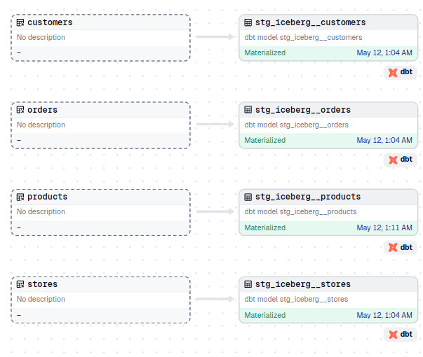

If the models are successfully materialized, you should see 4 table in project_staging schema.

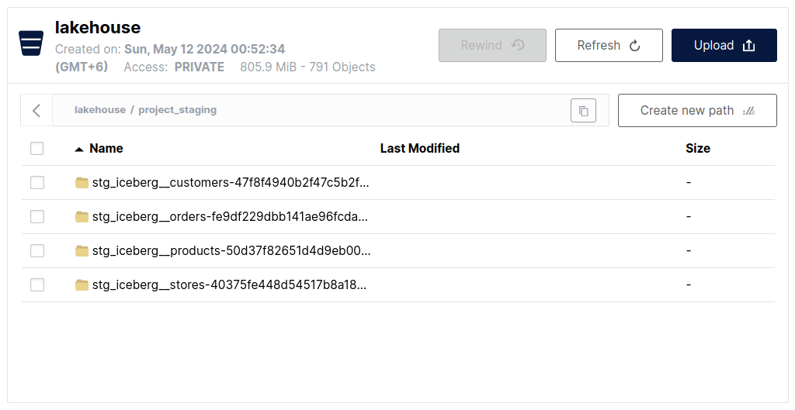

### Intermediate Models:

- Just like staging, inside `dbt/<example-project>/models` add a new directory `intermediate`
- Add the following files:
    - `int_iceberg.yml`:
        
      ```yaml title="dbt/<example-project>/models/intermediate/int_iceberg.yml"
      version: 2
      
      sources:
        - name: int_iceberg
          database: iceberg
          schema: project_staging
          tables:
            - name: stg_iceberg__orders
            - name: stg_iceberg__customers
            - name: stg_iceberg__products
            - name: stg_iceberg__stores
      
      models:
        - name: int_iceberg__denormalized_orders
      ```
        
    - `int_iceberg__denormalized_orders.sql`:
        
      ```sql title="dbt/<example-project>/models/intermediate/int_iceberg__denormalized_orders.sql"
      {{
      config(
        file_format='iceberg',
        materialized='incremental',
        on_schema_change='sync_all_columns',
        unique_key='order_id',
        incremental_strategy='merge',
        properties={
        "format": "'PARQUET'",
        "sorted_by": "ARRAY['order_id']",
        "partitioning": "ARRAY['device_type']",
        }
      )
      }}

      with denormalized_data as (
        select
          o.order_id,
          o.order_created_at,
          o.qty,
          o.product_id,
          o.customer_id,
          o.store_id,
          c.acc_created_at,
          c.first_name,
          c.last_name,
          --  Concatenated columns
          CONCAT(c.first_name, ' ', c.last_name) as full_name,
          c.gender,
          c.country,
          c.address,
          c.phone,
          c.email,
          c.payment_method,
          c.traffic_source,
          c.referrer,
          c.customer_age,
          c.device_type,
          p.name as product_name,
          p.category as product_category,
          (p.price/100) as product_price,
          p.description as product_description,
          p.unit_shipping_cost,
          s.name as store_name,
          s.city as store_city,
          s.state as store_state,
          s.tax_rate,
          -- Calculated columns
          (p.price/100) * o.qty as total_product_price,
          ((p.price/100) * o.qty) + p.unit_shipping_cost as total_price_with_shipping,
          (((p.price/100) * o.qty) + p.unit_shipping_cost) * (1 + s.tax_rate) as total_price_with_tax
        from {{ ref('stg_iceberg__orders') }} o
        left join {{ ref('stg_iceberg__customers') }} c
          on o.customer_id = c.id
        left join {{ ref('stg_iceberg__products') }} p
          on o.product_id = p.id
        left join {{ ref('stg_iceberg__stores') }} s
          on o.store_id = s.id
      )

      select *
      from denormalized_data
      ```
        
- In `dbt_project.yml` add this to models:
    
  ```yaml title="dbt/<example-project>/dbt_project.yml" {8-11} showLineNumbers
  ...
  models:
    quickstart:
      staging:
        +materialized: view
        +schema: staging
        +views_enabled: false
      intermediate:
        +materialized: view
        +schema: intermediate
        +views_enabled: false
  ...
  ```
    
- Test if the intermediate models are found on dagster Global Asset Lineage and materialize them. You should see a de-normalized table in `project_intermediate` schema.

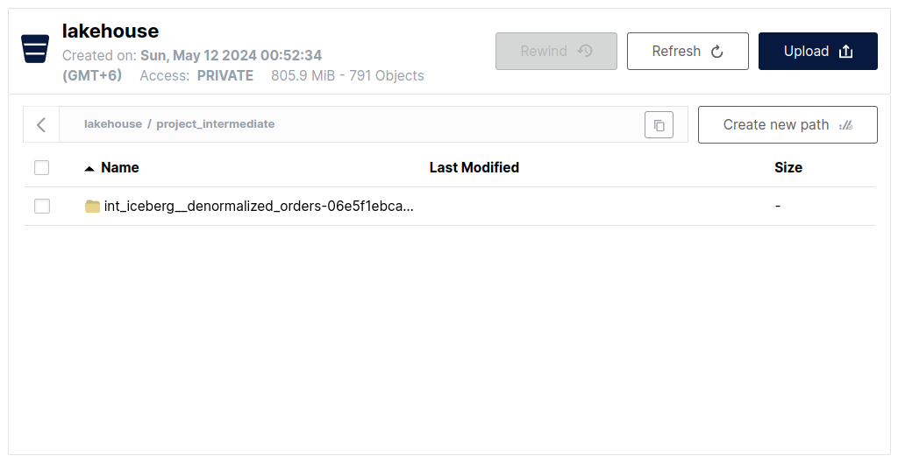

### Marts Models:

- Just like staging and intermediate, inside `dbt/<example-project>/models` add a new directory `marts`
- Add the following files:
    - `marts_iceberg.yml`:
        
      ```yaml title="dbt/<example-project>/models/marts/marts_iceberg.yml"
      version: 2
      
      sources:
        - name: marts_iceberg
          database: iceberg
          schema: project_intermediate
          tables:
            - name: int_iceberg__denormalized_orders
      
      models:
        - name: marts_iceberg__general
        - name: marts_iceberg__marketing
        - name: marts_iceberg__payment
      ```
        
      Notice how we are creating 4 different models from the table from `project_intermediate` schema for 4 different departments.
        
    - `marts_iceberg__general.sql`:
        
      ```sql title="dbt/<example-project>/models/marts/marts_iceberg__general.sql"
      {{
        config(
          file_format='iceberg',
          on_schema_change='sync_all_columns',
          materialized='incremental',
          unique_key='order_id',
          incremental_strategy='merge',
          properties={
            "format": "'PARQUET'",
            "partitioning": "ARRAY['traffic_source']"
          }
        )
      }}
      
      with final as (
        select * from {{ ref('int_iceberg__denormalized_orders') }}
      )
      
      select *
      from final
      ```
        
    - `marts_iceberg__marketing.sql`:
        
      ```sql title="dbt/<example-project>/models/marts/marts_iceberg__marketing.sql"
      {{
        config(
          file_format='iceberg',
          on_schema_change='sync_all_columns',
          materialized='incremental',
          unique_key='order_id',
          incremental_strategy='merge',
          properties={
            "format": "'PARQUET'",
            "partitioning": "ARRAY['traffic_source']"
          }
        )
      }}
      
      with final as (
        select
          order_id,
          order_created_at,
          qty,
          product_id,
          customer_id,
          store_id,
          traffic_source,
          referrer,
          product_name,
          product_category,
          product_description,
          unit_shipping_cost,
          store_name,
          store_city,
          store_state,
          tax_rate,
          total_price_with_shipping,
          total_price_with_tax,
          product_price,
          total_product_price
        from {{ ref('int_iceberg__denormalized_orders') }}
      )
      
      select *
      from final
      
      ```
        
    - `marts_iceberg__payment.sql`:
        
      ```sql title="marts_iceberg__payment.sql"
      {{
        config(
          file_format='iceberg',
          on_schema_change='sync_all_columns',
          materialized='incremental',
          unique_key='order_id',
          incremental_strategy='merge',
          properties={
            "format": "'PARQUET'",
            "partitioning": "ARRAY['payment_method']"
          }
        )
      }}
      
      with final as (
        select
          order_id,
          order_created_at,
          product_id,
          qty,
          unit_shipping_cost,
          tax_rate,
          total_price_with_shipping,
          total_price_with_tax,
          product_price,
          total_product_price,
          payment_method
        from {{ ref('int_iceberg__denormalized_orders') }}
      )
      
      select *
      from final
      ```
        
- In `dbt_project.yml` add this to models:
    
  ```yaml title="dbt/<example-project>/dbt_project.yml" {12-15} showLineNumbers
  ...
  models:
    quickstart:
      staging:
        +materialized: view
        +schema: staging
        +views_enabled: false
      intermediate:
        +materialized: view
        +schema: intermediate
        +views_enabled: false
      marts:
        +materialized: view
        +schema: marts
        +views_enabled: false
  ...
  ```
    
- Test if the marts models are found on dagster Global Asset Lineage.

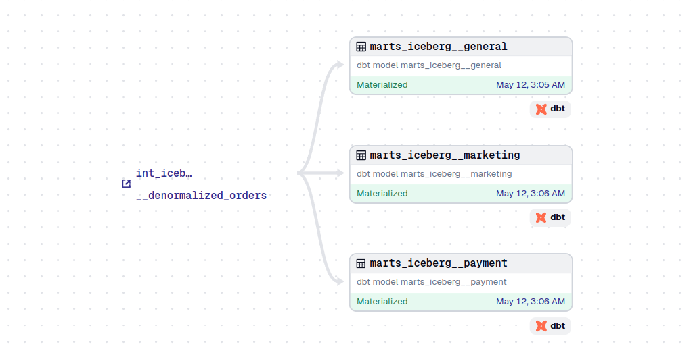

If materialized successfully, you should see 4 analytics-ready tables in project_marts schema.

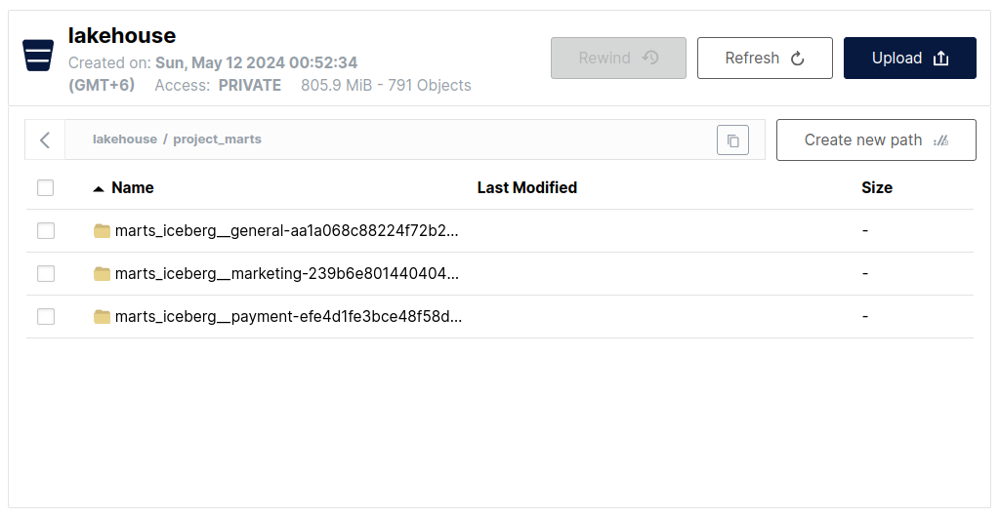

## Data Visualization

### Set up database connection

Go to http://localhost:8088 and login with the username `admin` and password `admin`

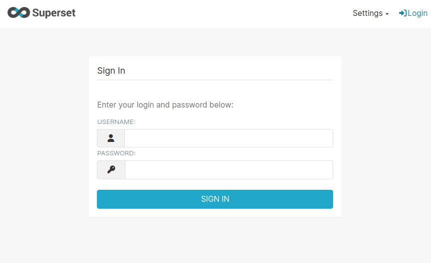

### Connect Database

Connect your database by going to http://localhost:8088/databaseview/list/, click on `+DATABASE`, in the popup, search for `Trino`, in the field where it says `SQLALCHEMY URI` enter `trino://[trino@host.docker.internal](mailto:trino@host.docker.internal):8081/<database-name>` (in our case, `iceberg`) and click on `Connect`

### Add Datasets

Add dataset by going to http://localhost:8088/tablemodelview/list/, click on `+DATASET`, in the new dataset page (at the sidebar) select `Trino` as `database`, project_marts as `schema` and `marts_iceberg__general` as `table`. Click on `CREATE DATASET AND CREATE CHART`

### Add Charts

Add chart by going to http://localhost:8088/chart/add, selecting the dataset and selecting a chart type, such as Bar Chart. Click on `CREATE NEW CHART`. Add Metrics and Dimensions. Add the name of the chart. Click on `UPDATE CHART` and `SAVE`

### Create Dashboards

Create a dashboard by going to http://localhost:8088/dashboard/list/ and clicking on `+DASHBOARD`. Give a title of the dashboard and drag and drop the charts you want to add to it. Finally, click on `SAVE`

### Create Example Charts

- **No. of Orders Over Time:**
    - Type: Line Chart
    - Columns: `order_created_at` and `COUNT(order_id)`
    - Description: The number of orders over time to visualize trends in order volume
    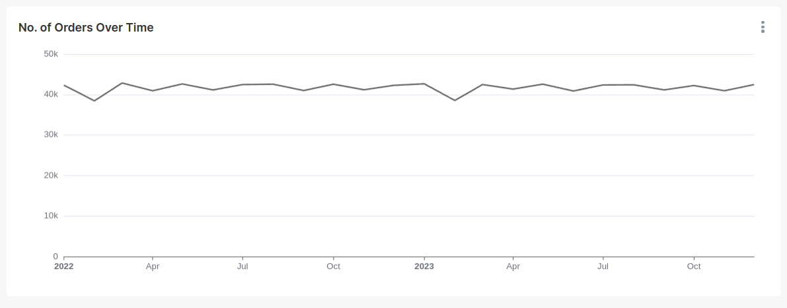
- **Total Revenue by Category:**
    - Type: Bar Chart
    - Columns: `product_category` and `SUM(total_product_price)`
    - Description: The total sales for each product category to identify the top-selling categories.
    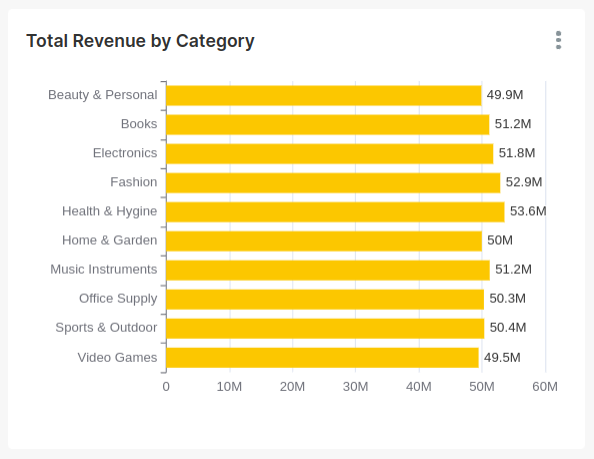
- **Customer Distribution by Country**
    - Type: World Map
    - Columns: `country` [full name] and `COUNT_DISTINCT(customer_id)`
    - Description: The distribution of customers by country to understand the geographic spread of your customer base.
    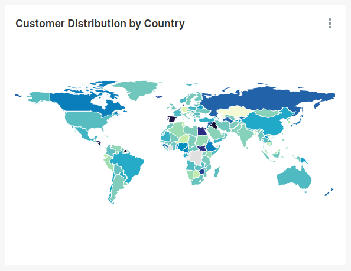
- **Average Order Value Over Time:**
    - Type: Line Chart
    - Columns: `order_created_at` and `AVG(total_price_with_shipping)`
    - Description: The average order value over time to track changes in purchasing behavior.
    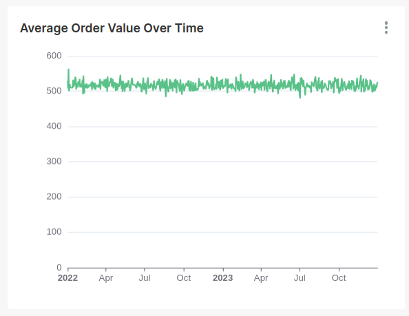
- **Customer Acquisition by Traffic Source:**
    - Type: Pie Chart
    - Columns: `traffic_source` and `COUNT(customer_id)`
    - Description: How customers are finding your store by visualizing the number of customers acquired from different traffic sources.
    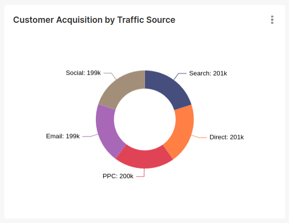
- **Average Customer Age by Gender:**
    - Type: Bar Chart
    - Columns: `gender` and `AVG(customer_age)`
    - Description: The customer ages by gender to understand the demographics of your customer base.
    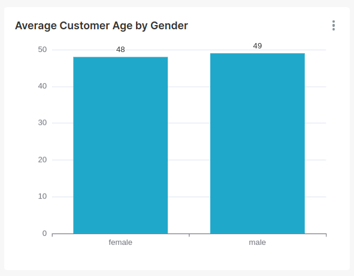
- **Top 10 Highest Revenue Generating Referrers:**
    - Type: Table
    - Columns: `referrer` and `SUM(total_product_price)`
    - Description: The top 10 referrer with the highest total sales generated
    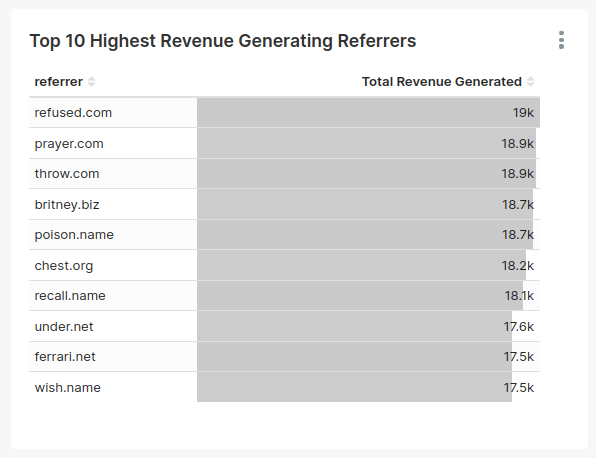
- **Payment Received by Payment Method:**
    - Type: Pie Chart
    - Columns: `payment_method` and `SUM(total_price_with_tax)`
    - Description: The total amount of payment received through payment methods
    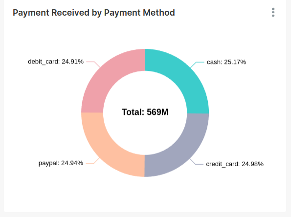
- **Big Numbers:**
    - No. of Countries
    - No. of Customers
    - No. of Orders
    - Sales Generated
    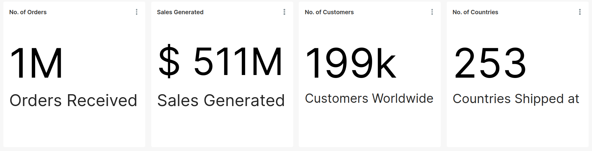

### Exporting/Importing Dashboards

You can also export and import dashboards on Superset. To export a dashboard, go to http://localhost:8088/dashboard/list/ and find the `Export` icon in the Actions column of your preferred dashboard.

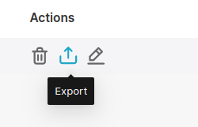

To import a dashboard, click on the `Import Dashboard` icon at the top-right corner, select file, and click on `Import`

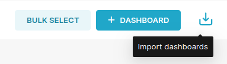

You can download and import the dashboard and charts we are building in this quick example from here.
<br />